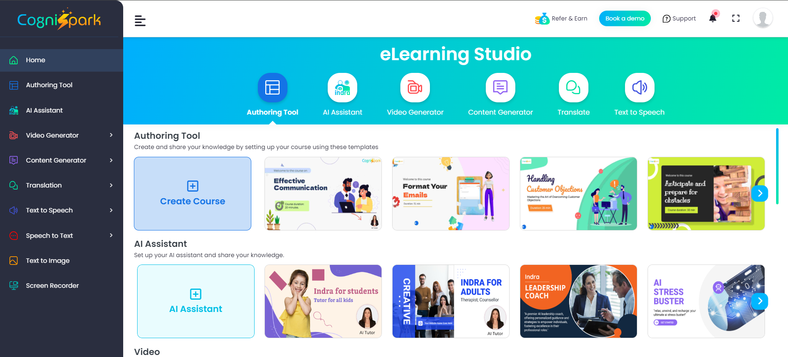
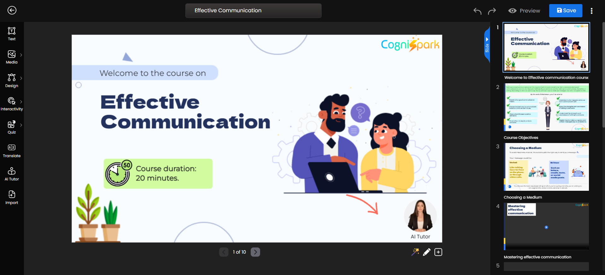
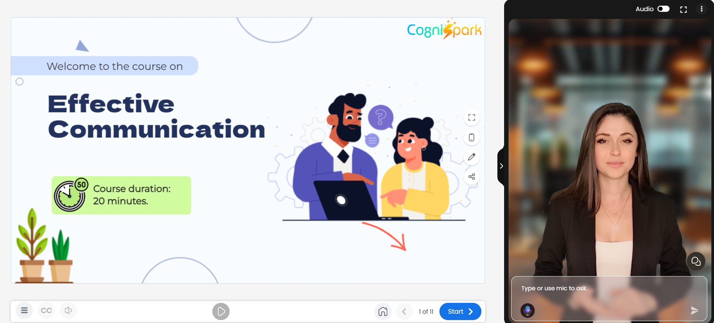
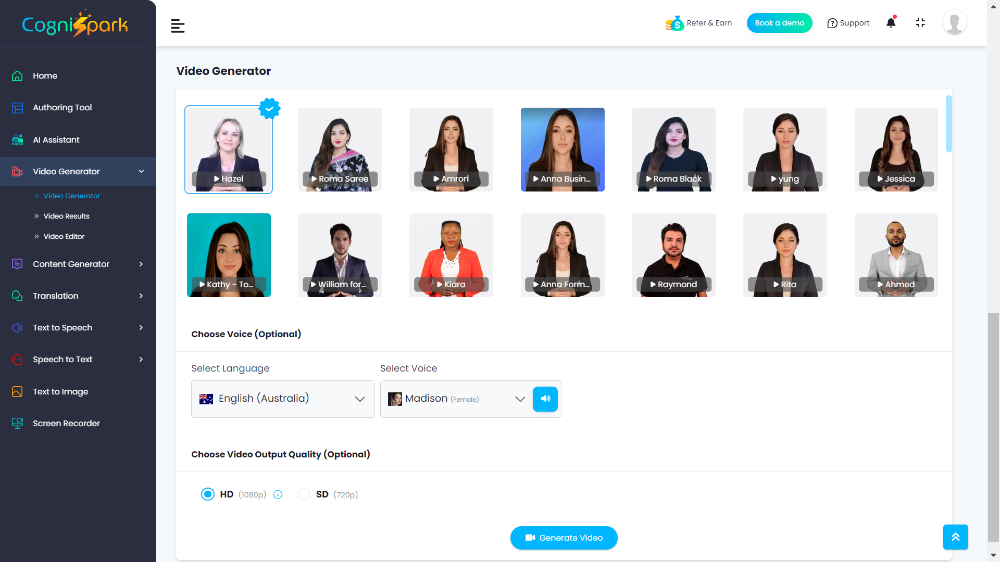

# CogniSpark Authoring Tool Plugin for Moodle

The CogniSpark plugin is a local plugin for Moodle that provides integration between the CogniSpark platform and Moodle. This integration allows Moodle users to utilize the CogniSpark platform by clicking on the CogniSpark link. The CogniSpark platform offers the following features:

1. **Course Authoring**: Create courses manually or with AI in minutes, utilizing a comprehensive authoring tool.
2. **Media Studio**: Create audio, video, images, translations, and content using Generative AI.
3. **AI Tutor/Assistant**: Create an AI Tutor to support your students in learning.

CogniSpark is not just a regular eLearning Authoring Tool. It is a set of AI-powered tools that help create, assist, and integrate course content for course creators, instructional designers, learning and development experts, and educators. It provides a quick and easy solution to become 10x more productive with 7x less cost.

## How?

A regular authoring tool lets you create comprehensive courses from scratch, while our AI-Powered Authoring Tool generates a full course with 50 slides, including videos with a human-like spokesperson and images. Our AI Authoring Tool includes inbuilt features such as a screen recorder, course templates, translation, voiceovers, and gamification options for quizzes and simulations.

## Exciting Features

### Unlock the Future of e-Learning with:
- **AI-Powered Course Creation**: Craft engaging courses effortlessly with AI-driven tools.
- **AI Tutor**: Provide personalized learning experiences with an intelligent AI tutor.
- **Interactive Quizzes**: Boost engagement with interactive quizzes and assessments.
- **Course Translation**: Break language barriers with seamless course translation capabilities.
- **Easy Course Conversion**: Convert your PPTs and PDFs into dynamic courses with ease.
- **Seamless Embedding**: Integrate courses directly into your LMS for a smooth user experience.
- **Cloud Storage**: Securely store and access your courses with reliable cloud storage solutions.
- **SCORM Export**: Support for SCORM v1.2 and v2004 for wide compatibility.
- **Cross-Platform SCORM Content**: Ensure your SCORM content is compatible with any LMS.
- **AI Spokesperson Video Generator**: Create engaging video content with AI-generated spokespeople.
- **AI Voiceover**: Add professional voiceovers to your courses with our AI tool.
- **AI Translator Tool**: Instantly translate course content to multiple languages.
- **AI Content Generator**: Generate rich, compelling content effortlessly with AI.
- **AI Text to Image**: Enhance your courses with AI-generated images from text.

### Get Started with Free Welcome Credits! 🎉
Transform your e-learning experience with cutting-edge AI features designed to make course creation and management easier, more interactive, and globally accessible.

## Useful Links
Website: [CogniSpark](https://www.cognispark.ai/)

## Video
https://www.youtube.com/embed/fFb4AW2B0FE?si=52aHEmnYL08zh24F

## Screenshots

